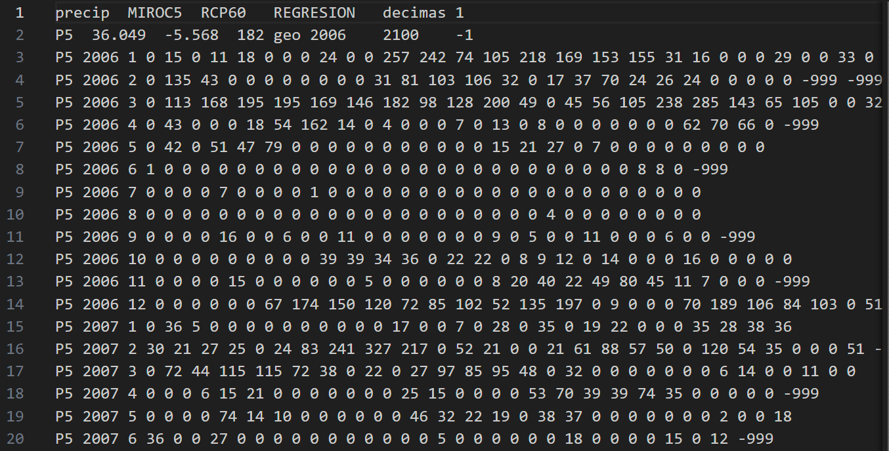

# TA06 Python CSV Web Sostenibilidad

# Índice del Proyecto TA06 Python CSV Web Sostenibilidad

- [Introducción](#introducción)
- [Estructura del Proyecto](#estructura-del-proyecto)
  - [Obtención de los datos](#obtención-de-los-datos)
  - [Programa](#programa)
    - [PAS1: Validación del formato](#pas1-validación-del-formato)
    - [PAS2: Detección del delimitador y columnas](#pas2-detección-del-delimitador-y-columnas)
    - [PAS3: Revisión de los datos](#pas3-revisión-de-los-datos)
    - [PAS4: Cálculo de totales y promedios anuales](#pas4-cálculo-de-totales-y-promedios-anuales)
    - [E03: Creación de gráficos](#e03-creación-de-gráficos)
- [WEB](#web)

## Introducción
En este proyecto hemos realizado un trabajo importante en el que hemos gestionado datos recogidos en la web de AEMET para extraer información relevante.

## Estructura del Proyecto
La estructura del proyecto se ha dividido en diferentes apartados.

### Obtención de los datos
La obtención de los datos se ha realizado desde la página oficial de AEMET, la cual ofrece información sobre las precipitaciones desde 2006 hasta 2100. Estos datos se encuentran en el subdirectorio `E01`.  

### Programa
En el subdirectorio `E02` se encuentran los archivos que procesan y convierten los datos en información valiosa.

#### PAS1
Este archivo valida el formato de los archivos obtenidos de AEMET, comprobando que la cabecera, la segunda línea y las separaciones entre datos cumplan el formato esperado, y contando los errores encontrados.  

![captura2]E04/Captura2.PNG

#### PAS2
La detección del delimitador y del número de columnas de los archivos CSV se ha realizado recorriendo un directorio, comprobando que todos los archivos tengan la misma extensión y mostrando en pantalla los detalles obtenidos.  

#### PAS3
La revisión de los datos se ha realizado asegurando que no contengan errores, valores faltantes o inconsistencias. Además, se ha verificado la consistencia de las columnas, comprobando que cada una tenga el tipo esperado.  

#### PAS4
El cálculo de los totales y promedios anuales de precipitación se ha realizado recorriendo los archivos `.dat` de un directorio y sus subdirectorios, leyendo los datos a partir de la tercera fila, convirtiendo los valores válidos (excluyendo los `-999`) de décimas de milímetro a milímetros, acumulando por año los totales, promedios (convertidos a litros por metro cuadrado), máximos y mínimos mensuales, calculando la variación porcentual interanual y exportando los resultados en un archivo CSV.  

#### E03
En este subdirectorio se encuentra el archivo que genera los gráficos a partir de los datos filtrados obtenidos.  

## WEB
La página web consta de diferentes gráficos que hemos creado a partir de los datos filtrados. La creación de la web se basa en un archivo HTML que sirve de estructura, un archivo CSS para editar la apariencia y un archivo JavaScript.  

  

  

 

